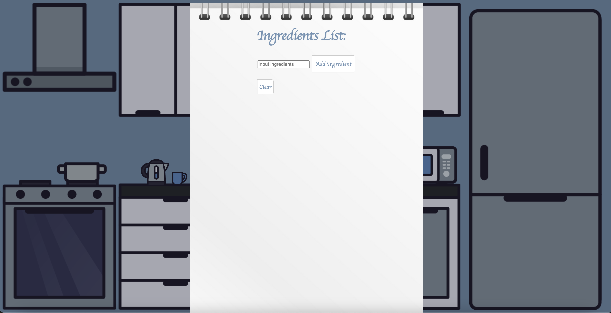

# Welcome to miKitchen!

[miKitchen](https://eltionbehrami.github.io/miKitchen/)

   miKitchen is a unique and engaging data visualization project that allows users to explore and interact with a 2D representation of a kitchen. In this interactive kitchen, users can click on different parts of the kitchen, and each piece of furniture or appliance serves a specific function or provides valuable information. Whether you're a cooking enthusiast, a nutrition-conscious individual, or simply curious, this project is designed to offer a fun and informative experience. The primary purpose of this project is to create an interactive kitchen environment that not only engages users but also educates them about cooking, nutrition, and the relationship between ingredients and recipes. By allowing users to interact with various kitchen elements, the project aims to provide an immersive learning experience that combines practical kitchen tasks with informative data visualization.

## Key Features

In miKitchen, users will be able to:

- Click on the fridge to select ingredients. This feature provides a practical way to simulate the process of gathering ingredients for a recipe.

 
  
- Refine their recipe choices by diet, cuisine, health restrictions, and more.


  
- Click on the oven to open up a cookbook where users can finally generate a recipe based on the input paramters. On generation, the user is presented with a random recipe

 

```
async generateRecipe(e) {
        let recipeList = this.recipe;
        let chartPage = document.getElementById("chart-page")
        let chartList = this.chart
        this.clearRecipes();

            let queryParams = this.fridge.ingredientItems + this.drawer.searchParams();
            await customFetch(queryParams)
            .then(data => {
                localStorage.setItem("recipes", JSON.stringify(data))
            })

            let recipes = JSON.parse(localStorage.getItem("recipes"))
            console.log(recipes)
            let hit = recipes.hits[Math.floor(Math.random() * 20)]
            let recipe = new Recipe(hit);

            let recipeItem = document.createElement('h1');
                recipeItem.innerText = recipe.label;
                recipeList.append(recipeItem);

            let recipeImage = document.createElement('img');
                recipeImage.src = hit.recipe.image;
                
            let recipeLink = document.createElement('a')
                recipeLink.href = hit.recipe.url
                recipeLink.append(recipeImage)
                recipeList.append(recipeLink);
                recipeLink.target = "_blank"

            let pieChartContainer = document.createElement('div')
                pieChartContainer.classList.add('pie-chart-container')
                recipe.generatePieChart(pieChartContainer)
                recipeList.append(pieChartContainer)

            let bubbleHeading = document.createElement("h1")
                bubbleHeading.innerText = "Nutrient Breakdown"
                chartList.append(bubbleHeading)

            let bubbleChartContainer = document.createElement('div')
                bubbleChartContainer.classList.add('bubble-chart-container')
                recipe.generateBubbleChart(bubbleChartContainer)
                chartList.append(bubbleChartContainer)
                chartPage.append(chartList)

            let tooltipContainer = document.createElement('div')
                tooltipContainer.innerHTML = `<p id="macro">label</p>
                <p><span id="value"> value </span></p>`
                tooltipContainer.classList.add("tooltip")
                tooltipContainer.setAttribute("id", "tooltip")
                pieChartContainer.append(tooltipContainer)

    }
```

- The generateRecipe function is an asynchronous operation that retrieves recipe data based on user input. It begins by initializing variables, clearing existing recipes, and constructing query parameters. It makes an asynchronous request using these parameters and stores the resulting data in local storage for later use. The function then selects a random recipe from the retrieved data and creates a user interface for it, including displaying the recipe's label, image, and a link to the full recipe. Additionally, it generates and displays nutritional information in the form of pie and bubble charts. In summary, the generateRecipe function fetches and presents recipes along with nutritional data to users in a web application, enhancing the user experience with dynamic content and visual representations of nutritional information.

  
- When finished, users can click on the dishwasher to start from scratch.


In addition, this project will include:

- This production README
- Social media links

## Technology Stack

This project will be implemented with the following technologies:
- JavaScript: The core language used to implement the interactive functionality.
- HTML/CSS: To create the user interface and layout of the 2D kitchen.
- Edamam Recipe Search API
- D3 Data Visualization Library


## Features in Development 

In addition to the core functionality of the interactive miKitchen, project updates might include:

1. **Calorie and Macronutrient Tracking System**
   - Users can specify daily calorie and macronutrient goals (protein, carbohydrates, and fats).
   - Track daily calorie and macronutrient intake by adding different recipes to their breakfast, lunch, and dinner plans.

2. **Meal Planner**
   - Create a meal planning feature that allows users to schedule and organize their daily meals.
   - Users can add recipes to their meal plans to meet their calorie and macronutrient goals for each meal.

3. **Save Favorite Recipes**
   - Allow users to save their favorite recipes for quick and easy access.
   - Users can build a collection of preferred recipes to use in their meal plans.


